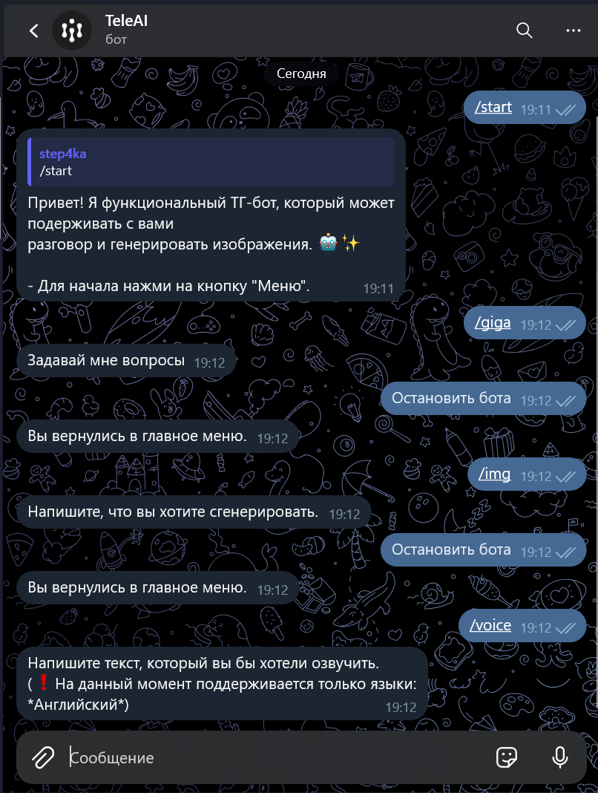

# TeleAI

*Телеграм бот с настраиваемым характером, генерацией изображений и преобразованием текста в голос*
*Данный репозиторий содержит исходный код телеграм бота.*

<a href='https://t.me/HSETeleBot' target='_blank'>

---

](HSEprewiew.png)

---

## Функционал
### 1.Настраиваемый характер
  Бот имеет возможность настраивать свой характер в соответствии с вашими предпочтениями.Просто напиши готовый вариант, или придуймай сам, желательно описать как можно больше
### 2.Ответы на вопросы
  Бот может оперативно отвечать на ваши вопросы. Он поддерживает множество тематик и может предоставлять информацию, помогать с поиском или просто поддерживать разговор.
### 3.Генерация изображений
  Бот имеет функционал генерации изображений на основе ваших запросов. Он может создавать простые рисунки, а также графики, схемы или живописные произведения искусства. Просто опишите, что вам нужно, и бот сгенерирует изображение, соответствующее вашим запросам.
### 4.Преобразование текста в голосовые сообщения
  Вы также можете преобразовывать текст в голосовые сообщения с помощью этого бота. Просто отправьте текстовое сообщение боту, и он вернет голосовую запись со сгенерированным аудио в соответствии с вашим текстом **Бот поддерживает только английский язык для преобразования в голосовое сообщение!** .

---

## Поддержка и обратная связь
  Если у вас есть какие-либо вопросы или замечания, пожалуйста, создайте issue в этом репозитории. Я и моя команда постараюсь ответить в ближайшее время.

*Приятного использования бота!*
